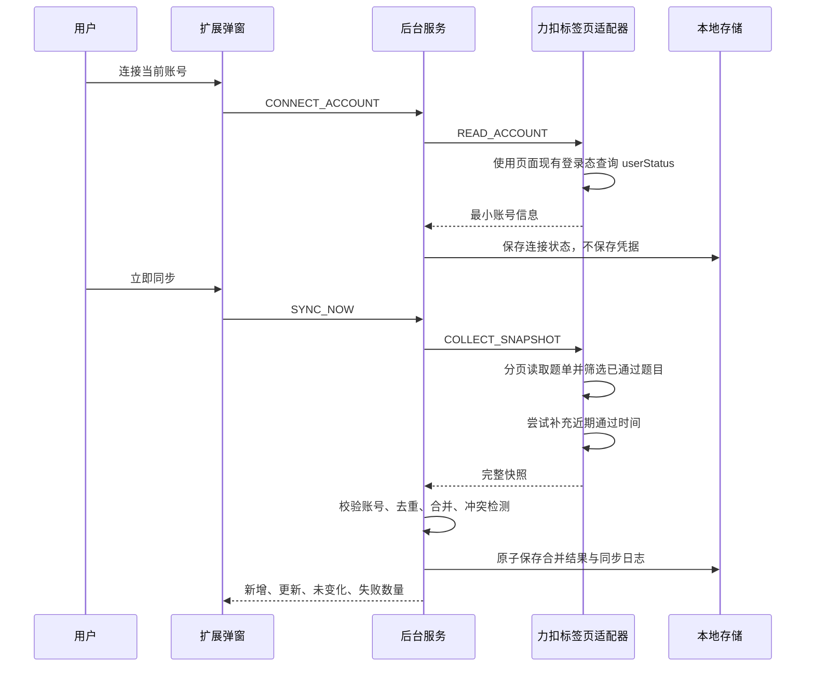

# LeetCode 复习插件：阶段三账号连接与记录同步

## 1. 文档信息

| 项目 | 内容 |
| --- | --- |
| 完成日期 | 2026-07-31 |
| 对应阶段 | 阶段三：账号连接与记录同步 |
| 覆盖任务 | `T-201` 至 `T-210` |
| 实现版本 | `0.1.0` |
| 阶段结论 | 实现、自动化测试和个人本地 MVP 最小真实账号人工验收通过 |

阶段三交付了一个可以直接加载的 Chromium Manifest V3 扩展，不需要构建或启动开发服务器。

## 2. 任务完成情况

| 任务 | 实现结果 | 主要证据 |
| --- | --- | --- |
| `T-201` | 提供账号连接入口，展示未连接、已连接、需登录和账号冲突状态 | `src/popup/`、`src/background.js` |
| `T-202` | 分页读取当前账号题目，仅导入 `SOLVED` 和 `PAST_SOLVED` 状态 | `src/content-script.js` |
| `T-203` | 提供“立即同步”，每次执行完整远端快照与本地增量合并 | `src/background.js`、`src/core/sync-service.js` |
| `T-204` | 使用来源 ID 主键和 slug 回退匹配，重复同步不新增重复题 | `src/core/sync-engine.js` |
| `T-205` | 展示新增、更新、未变化和失败数量 | `src/popup/index.html`、`src/popup/index.js` |
| `T-206` | 处理无标签页、未登录、会话失效、网络、超时、GraphQL 和字段变化错误 | `src/content-script.js`、`src/background.js` |
| `T-207` | 远端完整读取后才执行单次本地保存；失败只写错误日志，不修改题库 | `src/core/sync-service.js` |
| `T-208` | 支持“解绑并保留”和“解绑并删除”，界面明确两者影响 | `src/core/account.js`、`src/popup/` |
| `T-209` | 支持每 6、12 或 24 小时自动同步；无力扣标签页时安全延后 | `src/background.js`、`src/core/account.js` |
| `T-210` | 账号变化时阻止写入；远端题目消失时保留本地记录并标记冲突 | `src/core/sync-engine.js`、`src/core/account.js` |

## 3. 目录结构

```text
manifest.json
package.json
src/
  background.js
  content-script.js
  core/
    account.js
    errors.js
    state.js
    sync-engine.js
    sync-service.js
  popup/
    index.html
    index.js
    styles.css
  storage/
    chrome-storage.js
test/
  account.test.js
  sync-engine.test.js
  sync-service.test.js
```

## 4. 同步流程



## 5. 账号连接规则

- 扩展不提供账号密码输入框。
- 用户必须先在普通 `leetcode.cn` 标签页中登录。
- 数据请求在力扣标签页的内容脚本中执行，使用页面已有登录状态。
- 扩展不读取或保存明文密码、Session Cookie、CSRF 值或访问令牌。
- 本地题库记录 `dataOwnerUserSlug`，用于防止不同账号的数据被静默合并。
- 当前页面账号与数据所有者不一致时，停止连接和同步，并展示两个账号标识。
- 用户需要切回原账号，或者明确选择“解绑并删除”后才能连接新账号。

## 6. 题目读取与增量合并

### 6.1 数据来源

- 账号状态：`globalData.userStatus`；
- 题目列表：`problemsetQuestionListV2`；
- 近期通过时间：`recentACSubmissions`；
- 单页最多读取 100 条，分页间隔 120 毫秒，最多 60 页；
- 单次请求超时 20 秒。

如果状态筛选在登录环境中由服务器生效，只需读取已通过题目的分页；如果服务器返回混合状态，适配器仍会在本地只保留 `SOLVED` 和 `PAST_SOLVED`，并完成全部分页后再提交快照。

### 6.2 去重规则

1. 首选键为 `leetcode.cn:{sourceQuestionId}`。
2. 来源 ID 缺失时，回退为 `leetcode.cn:slug:{titleSlug}`。
3. 主键相同则更新来源字段。
4. 主键缺失但 slug 唯一匹配时补全主键。
5. 不同来源 ID 使用相同 slug 时标记冲突，不自动合并。
6. 重复同步不会创建第二张题目记录。

### 6.3 字段所有权

远端允许更新：

- 标题、中文标题、slug、题号；
- 难度、标签、付费标识；
- 平台完成状态和近期通过时间。

远端禁止覆盖：

- 用户复习状态、重点状态和掌握程度；
- 用户笔记；
- 复习历史；
- 后续阶段创建的 FSRS 卡片状态。

## 7. 失败保护

同步采用“先完整读取，后单次提交”的规则：

1. 内容脚本完成账号检查和全部分页。
2. 任一分页、结构校验或账号检查失败时，不产生可提交快照。
3. 后台收到完整快照后在内存中完成去重和合并。
4. 账号冲突或快照不完整时，停止保存题库。
5. 合并成功后调用一次 `chrome.storage.local.set` 保存完整状态。
6. 失败时只追加错误日志和连接状态，原题库对象保持不变。

空响应不能触发全量删除。完整快照中不再出现的已同步题目也不会被删除，而是标记为 `missing` 并附加 `NO_LONGER_IN_SOLVED_SNAPSHOT` 冲突记录。

## 8. 同步结果与历史

每次同步保存并展示：

- `added`：首次写入的题目数量；
- `updated`：来源字段变化或远端状态冲突数量；
- `unchanged`：远端字段未变化的题目数量；
- `failed`：字段无效、题目状态无效或单条记录无法识别的数量；
- `conflicts`：账号内远端状态变化或来源身份冲突数量；
- `warnings`：近期完成时间无法读取等不阻断主同步的问题。

同步历史最多保留 50 条。自动同步因没有打开力扣标签页而无法执行时记录为 `deferred`，不把连接状态改成错误。

## 9. 解绑行为

| 操作 | 连接状态 | 题库与历史 | 设置 | 数据所有者 |
| --- | --- | --- | --- | --- |
| 解绑并保留 | 清除 | 保留 | 保留 | 保留，防止连接其他账号后误合并 |
| 解绑并删除 | 清除 | 删除 | 保留 | 清除，可以连接其他账号 |

删除操作在弹窗对话框中明确说明影响。阶段八仍需补充正式的数据导出入口；在该入口完成前，删除操作应视为不可恢复。

## 10. 自动同步

- 默认关闭；
- 可选间隔为 6、12 或 24 小时；
- 使用 `chrome.alarms`，服务工作线程重启后会恢复计划；
- 只有连接状态为“已连接”时创建闹钟；
- 自动同步要求至少打开一个 `leetcode.cn` 标签页；
- 没有标签页时不自动打开页面，只记录延后并等待下一周期；
- 手动同步和自动同步同时触发时共享同一个进行中的同步任务，避免并发写入。

## 11. 多设备与冲突边界

阶段一明确排除了插件数据的云端多设备同步。因此 `T-210` 在本阶段处理的是“用户在其他设备上改变 LeetCode 账号数据，当前设备再次同步”产生的来源变化：

- 新通过题目作为新增题导入；
- 标题、难度和标签变化时更新来源字段；
- 已有题目从完整已通过快照中消失时保留本地数据并标记冲突；
- 当前登录账号发生变化时停止写入；
- 本地复习状态、笔记和历史始终优先，不被远端来源变化覆盖。

本版本不在浏览器之间同步插件的复习状态。该能力需要后续重新评估云端账号、加密、隐私和冲突模型，不能由 `chrome.storage.sync` 静默开启。

## 12. 扩展权限

| 权限 | 用途 |
| --- | --- |
| `https://leetcode.cn/*` | 在力扣中国站页面内读取当前用户主动同步所需数据 |
| `storage` | 保存本地账号状态、题库、设置和同步历史 |
| `alarms` | 执行可配置自动同步 |
| `tabs` | 查找已打开的力扣标签页并打开题单页 |
| `scripting` | 对安装扩展前已经打开的力扣页面补充注入内容脚本 |

未申请 `cookies` 权限。

## 13. 加载与试用

1. 在 Chrome 打开 `chrome://extensions`，或在 Edge 打开 `edge://extensions`。
2. 开启“开发者模式”。
3. 选择“加载已解压的扩展”，目录选择项目根目录。
4. 打开 `https://leetcode.cn/problemset/` 并完成登录。
5. 打开扩展，选择“连接当前账号”。
6. 连接成功后选择“立即同步”。
7. 核对题目总数和新增、更新、未变化、失败数量。

修改扩展文件后，需要在扩展管理页重新加载扩展。

## 14. 验证结果

执行命令：

```powershell
npm run check
npm test
```

验证结果：

- JavaScript 语法检查通过；
- Manifest JSON 可以正常解析；
- 16 项自动化测试全部通过；
- 覆盖首次同步、重复同步、元数据更新、用户字段保留、远端缺失、账号冲突、无效数据、快照不完整、网络失败、未登录、解绑和自动同步配置；
- 弹窗使用 Edge 150 按 `368 x 520` 尺寸完成静态渲染检查；
- 未发现文字重叠、按钮溢出或控件不可见问题。

## 15. 真实环境验收记录

用户已于 2026-08-01 使用真实登录账号完成个人本地 MVP 最小人工验收：

- 内容脚本能够识别当前账号；
- 首次同步 247 题，数量与力扣已通过题目数一致；
- 抽查题目元数据和近期完成时间通过；
- 重复同步不产生重复题，新增已通过题目可以增量写入；
- 手动状态在再次同步后保留；
- 退出登录后提示需要登录且已有题库不丢失。

截图、用户确认范围和未覆盖场景见[《真实账号最小人工验收记录》](./真实账号最小人工验收记录-2026-08-01.md)。断网超时、解绑两种模式和自动同步定时执行仍没有完整人工证据，因此不能表述为完整发布验收通过。

## 16. 已知限制

- 数据来源是力扣当前网页使用的非公开 GraphQL 接口，字段可能变化。
- 自动同步只有在已打开力扣标签页时执行。
- 近期通过接口只提供有限记录，不能回填完整历史首次通过时间。
- 业务数据当前保存在 `chrome.storage.local`，后续数据模型扩大时需要评估 IndexedDB 迁移。
- 当前只有同步和账号管理界面，个人题库与复习计划将在后续阶段实现。
- 未解决平台授权门槛前，不得将该扩展提交公开商店或商业化分发。
