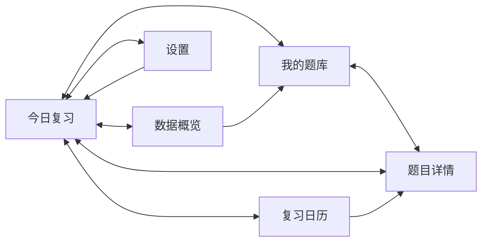
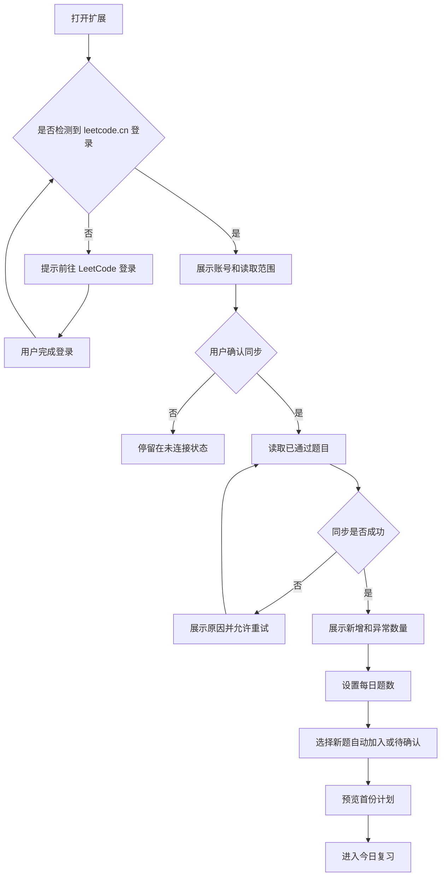
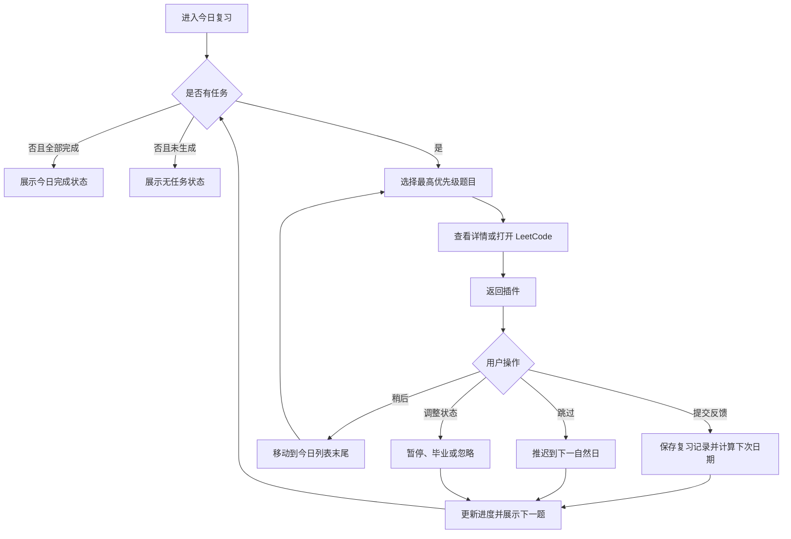
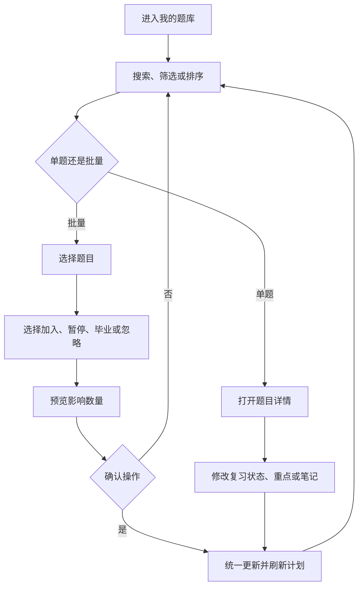
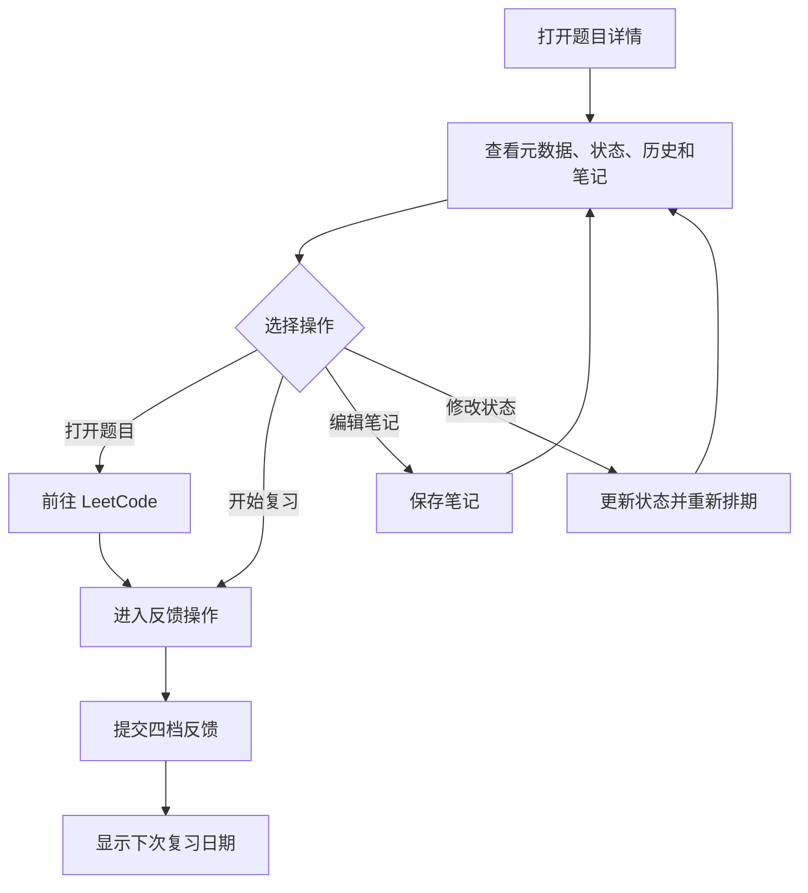
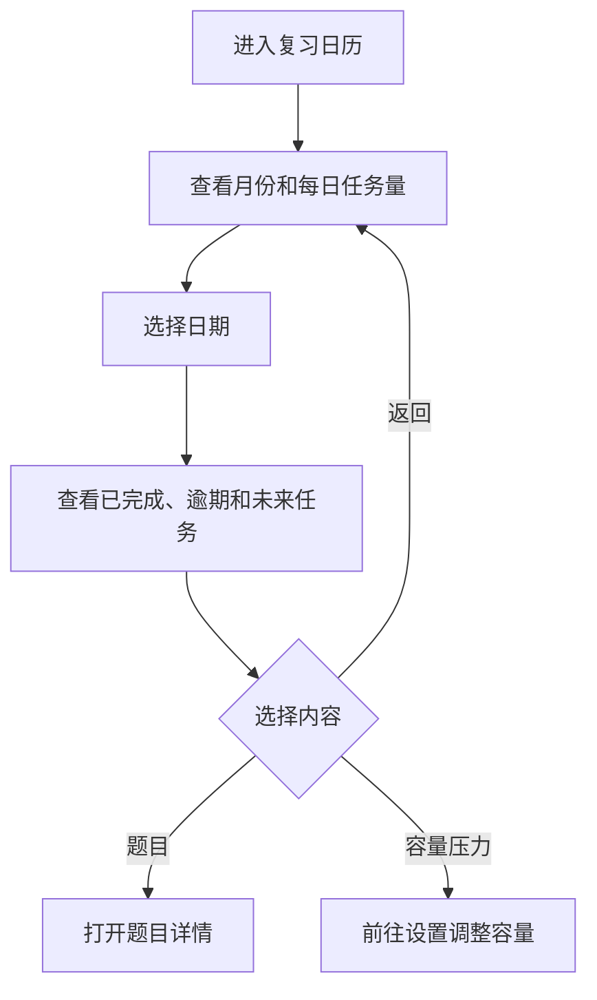
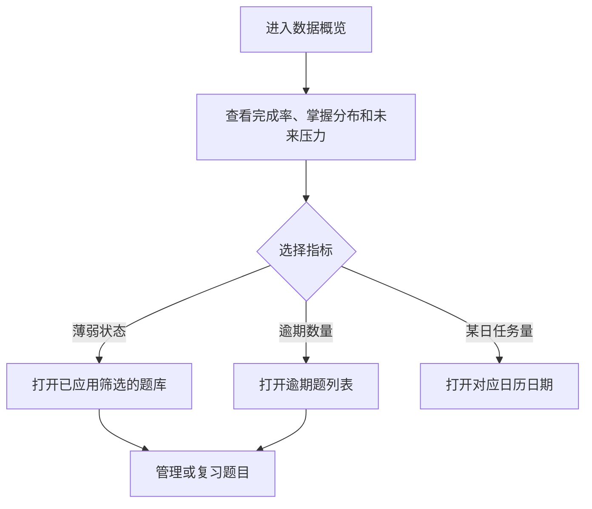
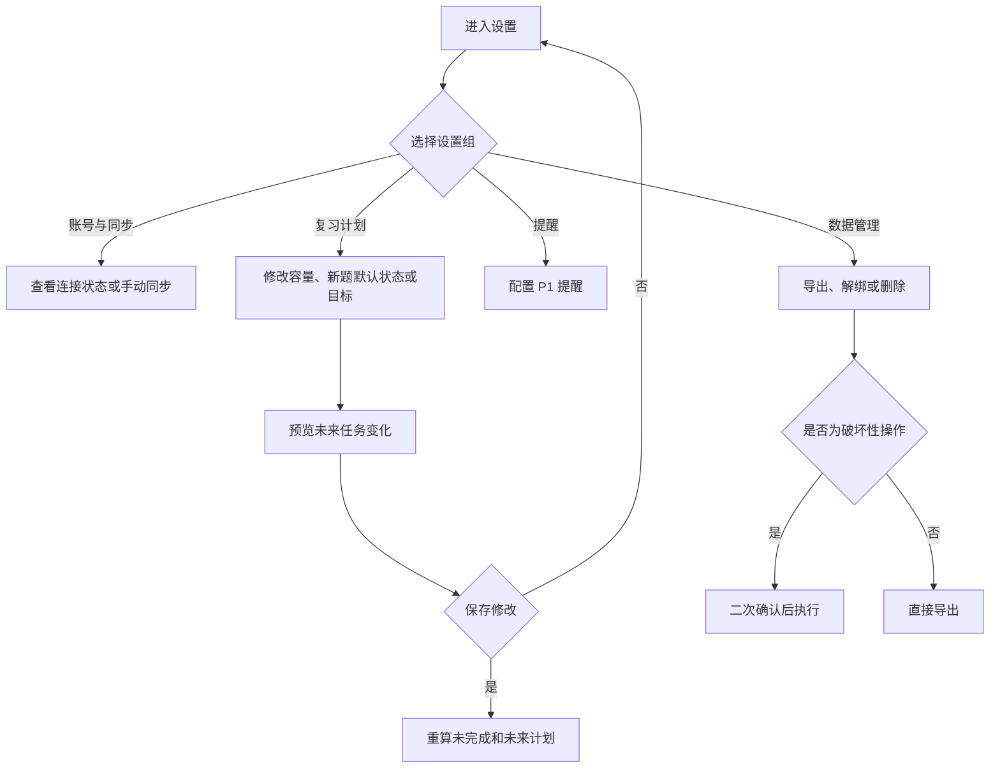

# LeetCode 复习插件：阶段二产品规则与交互设计

## 1. 文档信息

| 项目 | 内容 |
| --- | --- |
| 完成日期 | 2026-07-31 |
| 对应阶段 | 阶段二：产品规则与交互设计 |
| 覆盖任务 | `T-101` 至 `T-114` |
| 阶段结论 | 通过，可进入账号连接与同步设计 |
| 前置决策 | [阶段一范围与可行性决策](./阶段一-范围与可行性决策.md) |

本文档只定义产品规则、状态、调度行为和交互流程，不确定前端框架、数据库或具体代码结构。

## 2. 核心原则

1. **用户决定复习范围。** 平台同步不能覆盖用户设置的暂停、毕业、忽略和重点状态。
2. **计划不得突破容量。** 除非用户主动确认，今日计划不能超过每日题数或时间上限。
3. **反馈决定复习间隔。** 使用成熟的 FSRS 调度模型，不自行发明遗忘曲线。
4. **计划必须可解释。** 每道今日任务至少展示一个真实的推荐原因。
5. **缺失时间不可伪造。** 历史完成时间未知时，用首次同步时间作为内部排队基准，但界面仍显示“历史完成时间未获取”。
6. **同一输入产生同一结果。** 调度版本、参数、题目状态、当前时间和设置相同时，计划结果必须一致。
7. **同步失败不破坏本地记录。** 空响应、字段变化和授权失效均不能清空题库或复习历史。

## 3. 领域对象与术语

| 对象 | 含义 |
| --- | --- |
| 来源题目 | 从 `leetcode.cn` 同步的题目元数据和平台状态。 |
| 题库题目 | 已写入插件本地题库的题目。 |
| 复习卡片 | 题目加入复习后创建的调度状态；一道题最多对应一张有效卡片。 |
| 今日任务 | 在某个本地自然日内被选入计划的复习卡片快照。 |
| 复习记录 | 用户对一次复习提交的反馈、时间和调度结果。 |
| 到期日 | FSRS 计算出的下一次应复习日期。 |
| 基准时间 | 实际通过时间；缺失时使用首次同步时间，仅用于初始排队。 |
| 当前掌握程度 | 最近一次有效复习反馈，不代表永久水平。 |
| 复习状态 | 用户决定题目当前是否参与计划。 |

自然日以用户当前系统时区的 `00:00` 至次日 `00:00` 为边界。历史记录保存实际时间戳和记录时的时区；改变系统时区不会重写历史记录。

## 4. T-101：唯一标识与重复合并

### 4.1 标识规则

每道来源题目保存三类标识：

- 主标识：`sourceSite + sourceQuestionId`，例如 `leetcode.cn:1`；
- 次标识：`sourceSite + titleSlug`；
- 展示标识：`questionFrontendId`，只用于展示和搜索，不单独作为唯一键。

首版不跨站合并题目。即使 `leetcode.cn` 与其他平台题号、标题相同，也视为不同来源。

### 4.2 合并顺序

同步一条来源记录时按以下顺序处理：

1. 主标识完全相同：更新来源元数据，不新增题目。
2. 主标识不存在，但次标识唯一匹配：关联已有题目并补充主标识。
3. 主标识相同但 slug 变化：视为题目改名，更新 slug 和链接。
4. 主标识不同但 slug 相同：标记冲突，不自动合并。
5. 主标识缺失但 slug 有效：以次标识暂存，并标记“来源 ID 待补充”。
6. 主标识和 slug 均缺失：拒绝写入，计入同步失败数。

### 4.3 字段覆盖规则

- 来源可覆盖：标题、slug、难度、标签、付费标识、平台解题状态。
- 来源不可覆盖：复习状态、重点状态、掌握程度、FSRS 状态、笔记、复习历史和用户设置。
- 字段缺失不能把已有非空字段覆盖为空。
- 同步不得创建第二张有效复习卡片。
- 合并发生后，复习历史和笔记全部归入保留的题目记录，并留下合并审计记录。

## 5. T-102、T-103 与 T-104：复习状态与转换

### 5.1 复习状态

| 状态 | 含义 | 是否参与排期 |
| --- | --- | --- |
| 待确认 | 新同步题等待用户决定 | 否 |
| 复习中 | 已加入复习计划 | 是 |
| 暂停 | 暂时不复习，后续可恢复 | 否 |
| 已毕业 | 用户认为已经掌握，保留成果 | 否 |
| 忽略 | 用户明确不希望该题进入复习 | 否 |

“重点”是独立布尔属性，不是复习状态。任何状态均可保留重点标记，但只有“复习中”的重点题参与优先级计算。

### 5.2 掌握程度

| 反馈 | 判断标准 | FSRS 评分 | 展示含义 |
| --- | --- | --- | --- |
| 不会 | 无法独立完成，几乎忘记解法 | Again | 薄弱 |
| 模糊 | 知道方向，但无法顺利写出 | Hard | 待巩固 |
| 掌握 | 可以独立完成 | Good | 正常掌握 |
| 熟练 | 能快速说明思路并正确完成 | Easy | 熟练 |

未提交过反馈的题目显示“未评估”。当前掌握程度取最近一条有效反馈；删除或撤销最新反馈后，回退到上一条有效反馈。

掌握程度不会自动把题目标记为“已毕业”。毕业必须由用户主动确认，避免算法替用户永久移出题目。

### 5.3 允许的状态转换

| 当前状态 | 可转换到 | 结果 |
| --- | --- | --- |
| 待确认 | 复习中 | 创建或启用复习卡片，进入首次复习队列。 |
| 待确认 | 忽略 | 不创建计划，保留来源题目。 |
| 复习中 | 暂停 | 保存暂停时间和剩余间隔，从计划移除。 |
| 复习中 | 已毕业 | 保存毕业时间，从计划移除，保留全部历史。 |
| 复习中 | 忽略 | 从计划移除，保留全部历史。 |
| 暂停 | 复习中 | 按暂停恢复规则计算到期日。 |
| 暂停 | 已毕业、忽略 | 直接转换并继续保留历史。 |
| 已毕业 | 复习中 | 保留 FSRS 历史并将到期日设为今天。 |
| 已毕业 | 忽略 | 不参与计划。 |
| 忽略 | 待确认 | 恢复为待确认，不自动进入计划。 |
| 忽略 | 复习中 | 用户明确选择“恢复并加入复习”后进入首次或恢复队列。 |

### 5.4 状态操作规则

- 状态修改立即生效，并同步刷新题库、今日任务、日历和统计。
- 将今日任务暂停、毕业或忽略后，该任务从今日列表移除，但不计为已完成。
- 批量操作在执行前展示影响数量；毕业和忽略需要确认。
- 批量操作采用全成或全不成规则，失败时不留下部分更新。
- 同步发现题目仍然已通过时，不改变用户状态。
- 平台题目失效是独立的来源可用状态，不自动改成忽略或毕业。

## 6. T-105：每日容量

### 6.1 P0 题数模式

- 设置范围：每天 `1` 至 `50` 题。
- 默认值：每天 `5` 题。
- 调整步长：`1` 题。
- 容量表示当天最多计划完成的不同题目数量。
- 已完成任务占用当天容量；“稍后”和“跳过”不计为完成。
- 修改容量后，保留已完成任务，只重新计算未完成部分。
- 新容量小于当日已完成数时，不撤销完成记录，当天不再补充任务。
- 同步新增题目默认从下一次计划生成开始参与，不打乱正在进行的今日列表。

### 6.2 今日计划生成时机

- 当天第一次打开插件时生成；
- 日期变化后首次打开时生成新一天计划；
- 修改容量、题目状态或复习目标后重新计算未完成部分；
- 提交反馈后补充下一道候选题，直至达到当日容量；
- 同一自然日内，已完成记录不会因重新计算而改变。

## 7. T-106：复习优先级

### 7.1 候选资格

题目必须同时满足以下条件才能成为候选：

- 复习状态为“复习中”；
- 来源题目当前可访问，或用户已确认仍要复习不可访问题；
- 不处于全局计划暂停期；
- 属于已到期卡片，或者尚未完成首次复习的新卡片。

未来未到期题目默认不提前进入今日计划。面试冲刺模式是唯一允许提前复习的 P1 例外。

### 7.2 两级队列

候选题分为：

1. **到期队列：** 到期日小于或等于今天的卡片；
2. **首次复习队列：** 已启用但尚无有效复习记录的卡片。

先从到期队列取题；到期队列不足每日容量时，再从首次复习队列补足。这样不会在已有积压时继续大量引入新题。

### 7.3 到期队列排序

每道到期题计算优先分：

```text
优先分 = 逾期分 + 掌握分 + 重点分 + 连续未完成分

逾期分 = min(逾期天数, 30) * 10
掌握分：不会 80，模糊 50，掌握 20，熟练 0，未评估 35
重点分：重点题 40，普通题 0
连续未完成分 = min(连续未完成天数, 5) * 10
```

按以下顺序排序：

1. 优先分从高到低；
2. 到期日从早到晚；
3. 上次复习时间从早到晚；
4. 主标识按字符升序。

最后一项只用于保证结果稳定，不表达产品优先级。

### 7.4 首次复习队列排序

按以下顺序排序：

1. 重点题优先；
2. 基准时间从早到晚，长期未复习的历史旧题优先；
3. 题目难度按困难、中等、简单排序；
4. 主标识按字符升序。

难度只用于首次复习队列的末级排序，不会让一道未到期困难题压过已到期题目。

## 8. T-107：反馈与下次复习间隔

### 8.1 调度模型

复习间隔采用 FSRS（Free Spaced Repetition Scheduler）兼容实现：

- 不手写遗忘曲线；
- 默认目标记忆保持率为 `0.90`；
- 不开放用户修改 FSRS 参数；
- 首版关闭分钟级短期复习，同一道题一天最多计入一次正式复习；
- 最短间隔为 `1` 天，最长间隔为 `365` 天；
- 引擎版本、参数和时区规则随版本固定，升级时必须执行回归测试；
- 相同卡片状态、反馈、复习时间、引擎版本和参数必须得到相同结果。

### 8.2 四档反馈关系

| 用户反馈 | FSRS 输入 | 调度要求 |
| --- | --- | --- |
| 不会 | Again | 降低稳定性，进入最短一档复习间隔。 |
| 模糊 | Hard | 下次早于“掌握”，但不重置为全新题。 |
| 掌握 | Good | 使用标准间隔继续巩固。 |
| 熟练 | Easy | 下次晚于“掌握”，逐步延长间隔。 |

对同一卡片在同一时间分别模拟四档反馈时，调度结果必须满足：

```text
不会 <= 模糊 < 掌握 < 熟练
```

如果日粒度取整导致相邻档位落在同一天，保留 FSRS 原始到期时间用于排序，界面可显示同一天，但不能颠倒先后关系。

### 8.3 首次复习与缺失时间

- 新同步题不会根据无法确认的历史完成时间虚构 FSRS 记录。
- 题目在用户第一次提交反馈后才创建第一条 FSRS 复习记录。
- 首次同步基准只影响新题排队顺序，不直接影响后续间隔。
- 用户撤销最近一次反馈时，恢复提交前的卡片状态和到期时间。

### 8.4 反馈提交规则

- 一次任务只能产生一条有效反馈。
- 重复点击必须幂等，不能生成重复复习记录。
- 提交成功后立即展示新的下次复习日期。
- 保存失败时任务保持未完成，允许重试，不能先更新界面后静默丢失。

## 9. T-108 与 T-109：未完成、跳过、暂停和积压

### 9.1 稍后处理

- “稍后”只把题目移动到今日未完成列表末尾。
- 不创建复习记录，不修改到期日，不改变优先分。
- 关闭并重新打开插件后，仍保持在今日任务中。

### 9.2 跳过任务

- “跳过”将题目移出当天列表，最早在下一自然日重新出现。
- 不计为完成，不创建反馈，不修改 FSRS 卡片状态。
- 到期日保持不变，因此次日会体现逾期程度。
- 跳过后可以从候选队列补入另一题，但当日完成数仍不能超过容量。

### 9.3 当天未完成

- 日期变化后，未完成任务不再保留“今日已分配”身份。
- 卡片到期日不变，逾期天数自然增加。
- 不因未完成自动生成一次“不限”或“不会”反馈。
- 下一天重新参与统一排序，不保证仍在同一列表位置。

### 9.4 单题暂停与恢复

- 暂停时保存“距离到期剩余天数”，最小为 `0`。
- 暂停期间不增加该题的逾期天数。
- 恢复时，新到期日为“恢复日 + 暂停时剩余天数”。
- 如果暂停时已经到期，恢复后到期日设为恢复当天。
- 暂停不删除掌握程度、FSRS 状态、历史或笔记。

### 9.5 全局计划暂停与恢复

- 暂停期间不生成今日任务、不发送提醒。
- 恢复时，将暂停期间尚未到期卡片整体顺延暂停天数。
- 暂停前已经到期的卡片在恢复当天仍为到期，但受每日容量限制。
- 恢复不会一次性突破容量，也不会伪造暂停期间的完成记录。

### 9.6 容量不足和积压

- 今日列表始终受容量限制，未选中的到期题保留在积压队列。
- 到期题数量大于或等于容量时，不引入首次复习题。
- 积压不会被自动删除、毕业或降低优先级。
- 连续 3 天积压数量大于每日容量的 3 倍时，显示“计划压力较高”状态。
- 压力状态只提供调整入口：提高容量、暂停低优先级题、批量整理或保持当前节奏。
- 未经用户确认，系统不能自动提高容量。
- 未来任务预测分别显示“计划内”和“积压”，不能把积压平均摊平后伪装成已解决。

## 10. T-110：推荐原因文案

每道今日任务展示一个主要原因，最多附加两个状态标记。

### 10.1 主要原因

| 原因代码 | 触发条件 | 用户可见文案 |
| --- | --- | --- |
| `LAST_AGAIN` | 最近反馈为不会 | 上次没有掌握 |
| `LAST_HARD` | 最近反馈为模糊 | 上次掌握较模糊 |
| `OVERDUE` | 到期日早于今天 | 已逾期 {N} 天 |
| `FIRST_REVIEW` | 尚无有效复习记录 | 首次复习 |
| `OLD_BACKLOG` | 首次复习且基准时间距今至少 30 天 | 历史旧题待巩固 |
| `DUE_TODAY` | 到期日等于今天 | 今天到期 |
| `RESUMED` | 恢复后首次进入计划 | 恢复复习 |
| `INTERVIEW_EARLY` | 面试冲刺模式提前安排 | 面试计划提前复习 |

主要原因按表格顺序匹配，首个满足条件的原因生效。

### 10.2 状态标记

| 标记代码 | 用户可见文案 |
| --- | --- |
| `FOCUS` | 重点题 |
| `HARD_DIFFICULTY` | 困难题 |
| `TIME_UNKNOWN` | 历史完成时间未获取 |
| `PAID_LIMITED` | 访问可能受限 |

推荐原因必须来自实际状态，不能为了鼓励用户而生成无法验证的描述。

## 11. T-111：信息架构与页面流程

### 11.1 顶层导航



首次配置完成后默认进入“今日复习”。扩展再次打开时恢复用户上次停留的顶层页面，但存在未完成今日任务时，工具栏入口优先展示今日进度。

### 11.2 首次使用流程



### 11.3 今日复习流程



### 11.4 个人题库流程



### 11.5 题目详情流程



### 11.6 复习日历流程



日历只允许通过题目状态或设置修改未来计划，不支持拖拽单题到任意日期，避免破坏 FSRS 调度含义。

### 11.7 数据概览流程



### 11.8 设置流程



## 12. T-112：页面状态设计

### 12.1 全局状态

| 状态 | 展示与操作 |
| --- | --- |
| 初始加载 | 使用稳定尺寸的骨架内容，保留导航位置，避免页面跳动。 |
| 离线 | 顶部展示离线状态；允许查看本地数据和写复习笔记；禁用同步。 |
| 会话失效 | 展示“需要重新登录”，提供前往 LeetCode 的操作；本地功能继续可用。 |
| 同步进行中 | 显示进度和已处理数量；防止重复发起同步；允许关闭页面。 |
| 同步失败 | 说明失败阶段和数据影响，提供重试；不清空旧数据。 |
| 本地保存失败 | 保留当前输入并展示重试，不能显示虚假成功。 |
| 计划暂停 | 导航和历史可查看，今日任务区显示恢复操作。 |

### 12.2 页面状态矩阵

| 页面 | 空状态 | 正常状态 | 错误状态 | 完成状态 |
| --- | --- | --- | --- | --- |
| 首次使用 | 未连接账号，显示连接入口 | 显示同步和配置步骤 | 显示登录、网络或字段错误及重试 | 显示首份计划入口 |
| 今日复习 | 没有到期题，显示下次任务日期 | 显示任务、原因和进度 | 计划计算失败时保留昨日历史并允许重算 | 显示今日完成数和下一次到期概览 |
| 我的题库 | 账号无已通过题时提供同步入口；筛选无结果时提供清除筛选 | 显示列表和批量操作 | 数据读取失败时提供重载，不隐藏已知总数 | 不适用 |
| 题目详情 | 字段缺失时显示可用字段和“未获取” | 显示元数据、历史、状态和笔记 | 链接失效或保存失败时明确影响 | 反馈成功后显示下次日期 |
| 复习日历 | 无计划时提供返回题库加入题目 | 显示每日完成、逾期和未来数量 | 预测失败时不展示错误数量 | 当月无积压时显示正常状态 |
| 数据概览 | 数据不足时展示已有指标，不生成误导图表 | 显示完成率、掌握分布和压力 | 统计失败时允许重新计算 | 不适用 |
| 设置 | 不适用 | 显示当前值、影响范围和保存状态 | 保存失败时恢复原值并允许重试 | 保存成功后显示简短确认 |

### 12.3 关键文案

- 无今日任务：`今天没有到期题目`
- 今日完成：`今天的复习已完成`
- 账号未登录：`请先在力扣中国站登录`
- 会话失效：`登录状态已失效，请重新登录后同步`
- 同步失败：`本次同步未完成，已有题库未受影响`
- 历史时间缺失：`历史完成时间未获取`
- 计划压力：`逾期题较多，当前容量需要更长时间消化`
- 题目不可访问：`该题当前无法在力扣打开，历史记录已保留`

错误提示必须同时说明发生了什么、已有数据是否受影响以及用户下一步可以做什么。

## 13. T-113：按预计时间控制容量（P1）

### 13.1 设置规则

- 用户可在“按题数”和“按时间”之间单选。
- 时间范围：每天 `10` 至 `240` 分钟。
- 默认值：每天 `30` 分钟。
- 调整步长：`5` 分钟。
- 切换模式不修改 FSRS 到期日，只改变每日选题数量。

### 13.2 初始预计耗时

| 难度 | 默认预计耗时 |
| --- | --- |
| 简单 | 15 分钟 |
| 中等 | 25 分钟 |
| 困难 | 40 分钟 |
| 未知 | 25 分钟 |

完成至少 3 次有效复习后，可使用用户最近 10 次同难度复习的本地中位耗时替代默认值。单次有效耗时限制在 3 至 120 分钟，超出范围或页面长期闲置的数据不参与估算。

### 13.3 选题规则

1. 先按基础优先级得到候选顺序。
2. 从前到后加入预计耗时不超过剩余容量的题目。
3. 某道题放不下时继续检查后续候选，避免剩余时间完全浪费。
4. 当所有候选都超过总容量时，仍安排最高优先级的一题，并明确提示“预计超出今日时间”。
5. 同一天最多安排 20 道题，防止错误估时造成异常任务量。
6. 用户提交反馈后，用实际有效耗时更新后续估算，不回改今天已经完成的计划。

预计耗时只保存在本地，不默认上传。

## 14. T-114：复习目标（P1）

用户同一时间只能启用一种目标，使用分段选择控件切换。

### 14.1 日常巩固

- 默认目标；
- 使用基础到期队列、首次复习队列和 FSRS 间隔；
- 不提前安排未来未到期题目；
- 适合长期稳定复习。

### 14.2 薄弱题优先

- “不会”额外增加 `60` 优先分；
- “模糊”额外增加 `30` 优先分；
- 首次复习题最多占当天容量的 `20%`；
- 不改变 FSRS 到期日，不突破每日容量；
- 当不存在到期薄弱题时，回退到日常巩固规则。

### 14.3 面试冲刺

启用时必须设置：

- 面试日期，范围为当前日期后 `7` 至 `90` 天；
- 冲刺范围，可按重点题、标签、难度或手动题单选择；
- 每日容量，必须由用户主动确认。

调度变化：

- 冲刺范围内题目额外增加 `80` 优先分；
- 可提前安排未来 `min(7, 距面试剩余天数)` 天内到期的冲刺题；
- 提前复习仍作为真实反馈提交给 FSRS，并重新计算下次日期；
- 面试日期结束后自动回到日常巩固，但保留原 FSRS 历史；
- 冲刺模式不自动提高每日容量，也不自动加入用户已经暂停、毕业或忽略的题目。

### 14.4 目标切换

- 切换目标立即重算当日未完成部分和未来预测；
- 已完成任务和历史记录不变；
- 关闭冲刺不会撤销冲刺期间已经产生的有效复习记录；
- 所有目标只改变候选范围或排序，不覆盖用户的题目复习状态。

## 15. 确定性示例

每日容量为 3，当前存在以下候选：

| 题目 | 状态 | 到期情况 | 最近反馈 | 重点 | 结果 |
| --- | --- | --- | --- | --- | --- |
| A | 复习中 | 逾期 2 天 | 不会 | 否 | 到期队列，优先分 `100` |
| B | 复习中 | 逾期 5 天 | 掌握 | 是 | 到期队列，优先分 `110` |
| C | 复习中 | 今天到期 | 模糊 | 否 | 到期队列，优先分 `50` |
| D | 复习中 | 尚未首次复习 | 未评估 | 是 | 首次复习队列 |
| E | 复习中 | 尚未首次复习 | 未评估 | 否 | 首次复习队列 |

今日任务顺序为 `B、A、C`。因为到期队列已经达到容量，重点新题 D 不在今天加入。容量提高到 4 后，D 作为重点首次复习题补入。

该示例必须作为后续计划计算测试用例保留。

## 16. 阶段完成判定

- [x] 题目身份、去重和冲突处理有确定规则。
- [x] 五种复习状态和四档掌握反馈定义完整。
- [x] 所有允许的状态转换、暂停和恢复行为已定义。
- [x] 题数容量、P1 时间容量和计划重算时机已定义。
- [x] 到期、薄弱、重点、首次复习和历史旧题的优先级可计算。
- [x] 四档反馈与 FSRS 调度关系明确。
- [x] 未完成、稍后、跳过和积压不会突破用户容量。
- [x] 推荐原因具有确定的触发条件和用户文案。
- [x] 七类核心页面均有可走通的流程。
- [x] 空、加载、错误、无任务和完成状态均有处理方式。
- [x] 三种 P1 复习目标及切换行为已定义。
- [x] 同一输入能够得到稳定且可解释的计划结果。

阶段二完成后，可以进入阶段三“账号连接与记录同步”。实现阶段必须保留调度引擎版本和参数，不得用未记录的随机数或当前列表顺序作为优先级依据。
